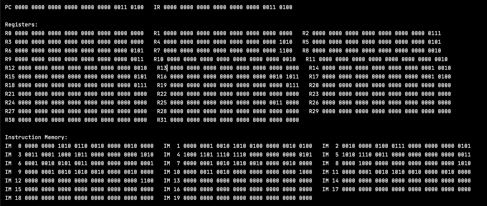

Students: Deline Zent and Alex Amado
Class:TCSS 372 - Computer Architecture
Project: 2A - MIPS Simulator

Description: MIPS simulator emulates the MIPS ISA and works with instructions add,
and, addi, andi, lw, sw, beq, j, jr, and syscall (where the syscall line is assumed
to always be a terminating call in our implementation). This enabled us to understand
how machine code works at a very intricate level and we were able to implement 90% 
junit test coverage on all of our classes. 

Some Console Output of the Changing Machine Code

Junit Coverage Proof

How To Run: To see an example of how our code works, you can go into the Simulator class
where we have already pre-filled the computer with instructions. We have tested every
implemented word in our pre-designed simulator program and have a comment of expected
output you can look for. The assembly version of the machine code is also written
as a comment below the program.

Changing the View: To change the amount of instruction memory and data memory you want to 
view, you can limit the range by putting in values for MAX_INSTRUCTIONS and MAX_DATA_MEMORY
at the top of the simulator class so that you don't need to parse through 700 lines of
instructions between the 200 in Instruction Memory and the 500 in Data Memory each time.

Terminating: We have implemented the syscall machine code to always signify a terminating
call in our implementation of MIPS. We know this isn't completely in alignment with the 
actual MIPS ISA, however, since we were not required to implement a halt we took some
liberties.

Tests: All of our tests are written in JUnit 4. We have written tests for every method in
the Computer class and for every additional method we wrote after the starter code in the 
BitString class. These tests can be found in the tests folder.
